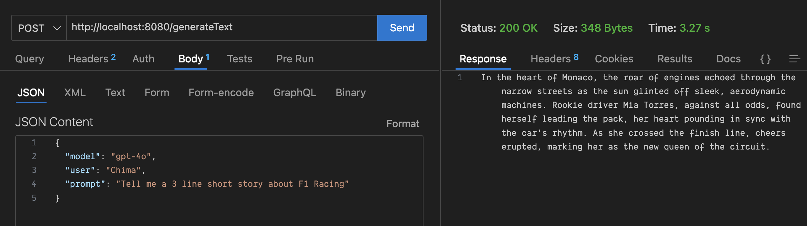

# globe_ai_example

Example project showcasing usage of [globe_ai](https://pub.dev/packages/globe_ai) package.



## Setup

- Install [Globe Runtime](https://github.com/invertase/globe_runtime) for Local Development

  ```sh
  dart pub global activate globe_cli 0.0.16-dev.1
  ```

  ```sh
  globe runtime install
  ```

- Provide `OPENAI_API_KEY` in Environment Variable or Pass it to OpenAI Config.

  ```sh
  export OPENAI_API_KEY="sk-proj-xxxxxxi_Gxxx"
  ```

  or

  ```dart
  final openai = OpenAI(OpenAIConfig(apiKey: 'OpenAIKey'));
  ```

## Run project

```sh
dart run bin/server.dart
```
